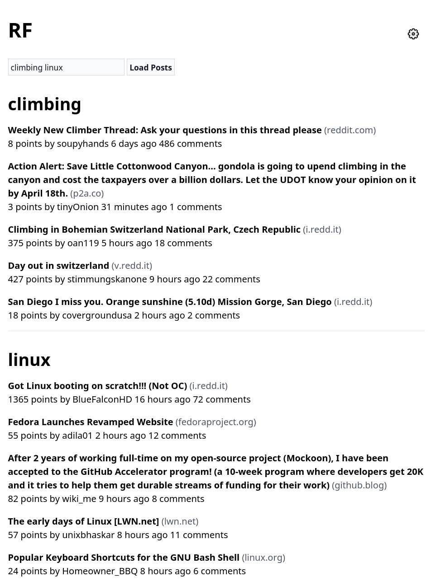
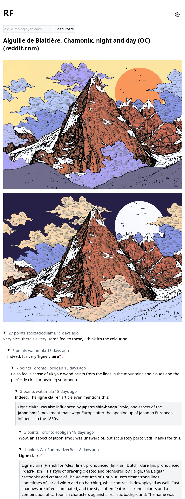
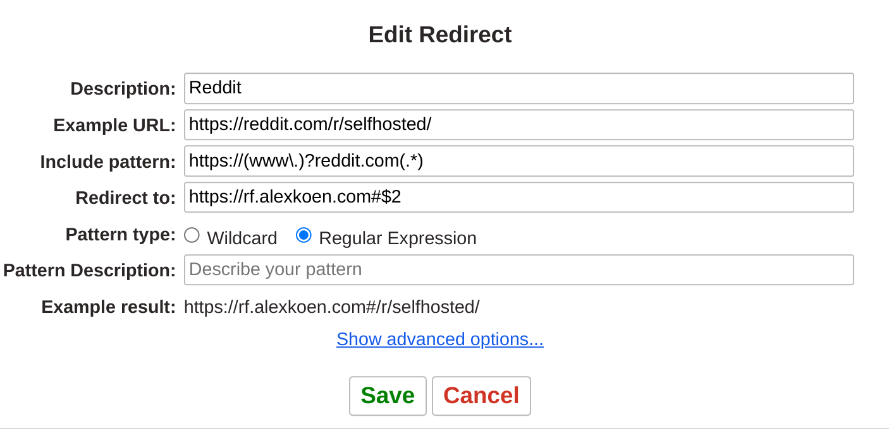

# RF: A Reddit Frontend

RF is a portable Reddit frontend distributed as a single HTML file. Try it [here](https://rf.alexkoen.com/#/r/eyebleach+programming) or download it to your device.

# Features
- [x] Bundled as a single HTML file
- [x] Multireddit support
- [x] HN-style comment navigation
- [x] "Instant" post loading
- [x] Inline media preview
- [x] Optional link preview with 12ft.io (disabled by default)
- [x] PWA support

# Screenshots

 
<em><a href="https://rf.alexkoen.com/#/r/climbing+linux">Multireddit support with configurable number of posts.</a></em>

 
<em><a href="https://rf.alexkoen.com/#/r/climbing/comments/121ogdt/aiguille_de_blaitière_chamonix_night_and_day_oc/">Embedded multimedia preview.</a> Supports images, galleries, videos and more.</em>

 
<em><a href="https://rf.alexkoen.com/#/r/programming/comments/x8el14/how_the_sqlite_virtual_machine_works/">Inline link-preview</a> (enable in settings).</em>

# Redirecting from Reddit.com

RF supports handling standard Reddit URLs as location hashes. You can therefore use the [Redirector](https://github.com/einaregilsson/Redirector) browser extension to route all Reddit links to RF.

# Notes

- Because RF does not provide its own backend it's limited by CORS policies. You may need to disable your browser's "enhanced tracking protection" for this site for it to work.
- Although Add to Home Screen is supported on most browsers, the experience on mobile is subjectively better as a normal site as external links display in new tabs.
